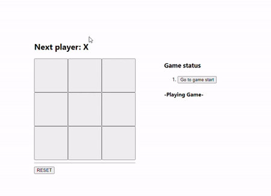

# React 공식문서 Tic-Tac-Toe

🙂 **[공식문서 기본 기능]**

* 틱택토 게임
* 게임 승리 시 우승자 표기
* 진행되는 게임 기록 저장
* 게임 기록 시점으로 이동할 수 있음

 

🤩 **[구현한 추가 기능]**

* 게임 종료 alert
* 게임 종료시 우승한 플레이어의 사각형 강조
* 게임 진행 중, 게임 종료 스테이터스 표기

 

🤔 **[더 많은 추가 기능]**

* 무승부 메시지 alert
* 함수형 컴포넌트로 코드 리팩토링
* UI 개선